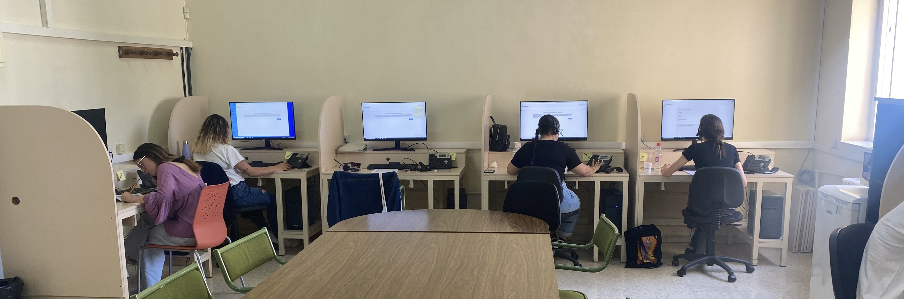
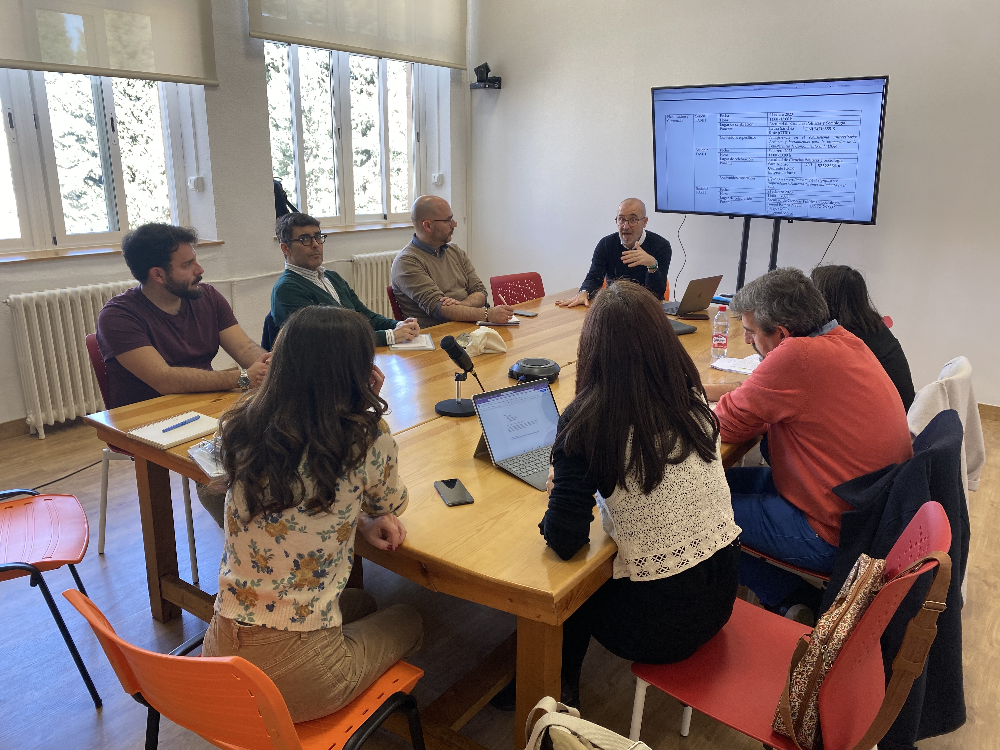
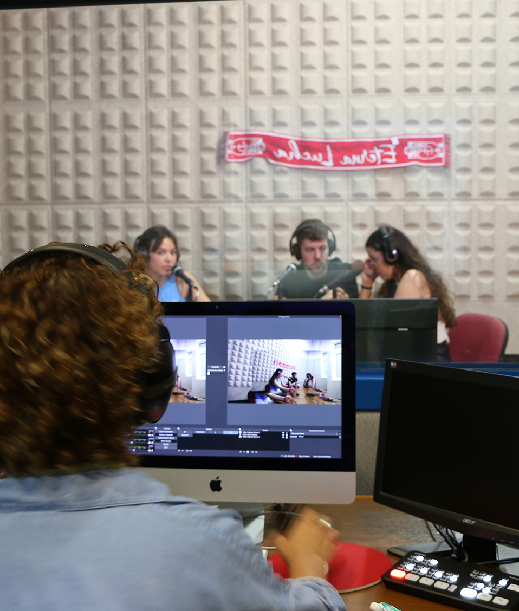

## PoliSocioLAB {.polisociolab}

```{=html}
<div class="polisociolab-fotos">
  <div class="lab-cuantitativo"></div>
  <div class="lab-cualitativo"></div>
  <div class="lab-radio"></div>
  <a class="lab-enlace" href="https://polisocio.ugr.es/investigacion/polisociolab" target="_blank" rel="noopener">
    
    <span class="lab-info">
      <span>Más información</span>
      <span class="lab-url">polisocio.ugr.es/investigacion/polisociolab</span>
    </span>
  </a>
</div>
```

## ¿Qué vamos a hacer en esta clase? {.practica}

A partir de un estudio reciente del CIS sobre diversidad sexual, trabajaremos **en grupos** para:

1. Formular una **pregunta de investigación**.
2. Definir un **objetivo**.
3. Identificar **variables relevantes**.
4. Realizar un **análisis univariable y bivariable** directamente en la web del CIS.
5. Sacar **conclusiones** a partir de los datos.
6. **Exponer el trabajo** al final de la clase.

## Pasos de la actividad {.center .transicion data-background-color="#CB2C30"}

## Cómo formular una pregunta de investigación {.pregunta-investigacion}

Una pregunta de investigación dice **qué queremos averiguar con los datos**.

::: {.pregunta-columnas}
::: {.pregunta-pasos}
1. **Elige algo que te interese:** una actitud, opinión o comportamiento.
2. **Consulta qué información ofrece la encuesta** sobre ese tema.
3. **Escríbelo como una pregunta** que podamos responder con la encuesta.
:::

::: {.pregunta-ejemplo}
::: {.pregunta-ejemplo-titulo}
**Ejemplo con esta encuesta**
:::

¿Cómo varía el apoyo a los derechos LGTBIQ+ según la edad?

**Lo que queremos explicar:** apoyo a los derechos LGTBIQ+.

**Con qué lo comparamos:** edad.
:::
:::

## Definir el objetivo y seleccionar variables {.objetivo-variables}

::: {.objetivo-texto}
**Objetivo:** analizar la relación entre la edad y el apoyo a los derechos LGTBIQ+.
:::

::: {.variables-preguntas}
::: {.variable-definicion}
**1. ¿QUÉ quiero explicar?**

**Variable dependiente (VD)**

Aquello que queremos explicar.
:::

::: {.variable-definicion}
**2. ¿SEGÚN QUÉ quiero compararlo?**

**Variable independiente (VI)**

La que usamos para comparar o explicar.
:::
:::

::: {.variables-ejemplo-pregunta}
**Ejemplo:** ¿El <span class="fragment highlight-red" data-fragment-index="0">apoyo a los derechos LGTBIQ+</span> cambia según la <span class="fragment highlight-red" data-fragment-index="0">edad</span>?
:::

::: {.fragment data-fragment-index="1"}
```{=html}
<div class="variables-ejemplo">
  <div class="variable-ejemplo">
    <span class="variable-nombre">EDAD</span>
    <span>Variable independiente (VI)</span>
  </div>
  <span class="variable-flecha" aria-label="se compara con">→</span>
  <div class="variable-ejemplo">
    <span class="variable-nombre">APOYO A LOS DERECHOS LGTBIQ+</span>
    <span>Variable dependiente (VD)</span>
  </div>
</div>
```

::: {.variables-recordatorio}
**Para recordarlo:** «¿QUÉ cambia SEGÚN QUÉ?» · **QUÉ cambia = VD** · **SEGÚN QUÉ = VI**
:::
:::

## {.blank .logos-slide .center}

```{=html}
<div class="logos-lenguajes">
  
  
</div>
```

::: notes
Logotipo R: © 2016 R Foundation. Fuente: https://www.r-project.org/logo/. Licencia CC BY-SA 4.0: https://creativecommons.org/licenses/by-sa/4.0/. Sin modificaciones.

Logotipo Python: Python Software Foundation. Fuente: https://www.python.org/community/logos/. Sin modificaciones.
:::

## Analizar, concluir y presentar {.siguientes-pasos}

::: {.pasos-analisis}
::: {.paso-actividad}
::: {.paso-cabecera}
**3. Análisis univariable**
:::

**Una sola variable:** buscad frecuencias o porcentajes en las tablas del CIS.

*Ejemplo:* ¿Qué porcentaje cree que reconocer los derechos LGTBIQ+ beneficia a la sociedad?
:::

::: {.paso-actividad}
::: {.paso-cabecera}
**4. Análisis bivariable**
:::

Cruzad **dos variables**, como edad y reconocimiento de derechos. Buscad diferencias o patrones.

*Ejemplo:* ¿Difiere la actitud hacia las personas LGTBIQ+ según el nivel de estudios (universitarios o primarios)?
:::

::: {.paso-actividad}
::: {.paso-cabecera}
**5. Escribir la conclusión**
:::

- ¿Qué descubristeis con los datos?
- ¿Qué relación encontrasteis entre las variables?
:::

::: {.paso-actividad}
::: {.paso-cabecera}
**6. Preparar la exposición**
:::

Al final de la clase, **cada grupo presentará**:

- Pregunta y objetivo.
- Variables analizadas.
- Resultados principales **en forma de tabla**.
- Conclusión.
:::
:::

## Producto final esperado {.producto-final}

Al final de la sesión, cada grupo deberá haber **elaborado y expuesto brevemente**:

- **1 pregunta de investigación**
- **1 objetivo claro**
- Variables seleccionadas
- Análisis univariable
- Análisis bivariable
- **Conclusión escrita y compartida en PRADO**
