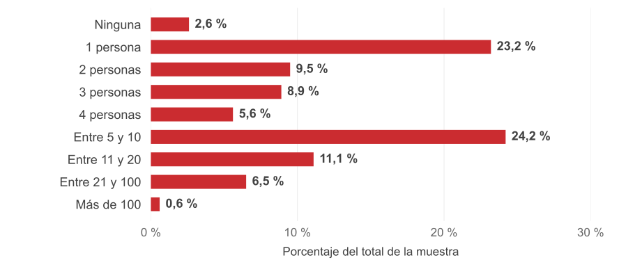

## PoliSocioLAB {.polisociolab}

```{=html}
<div class="polisociolab-fotos">
  <div class="lab-cuantitativo"></div>
  <div class="lab-cualitativo"></div>
  <div class="lab-radio"></div>
  <a class="lab-enlace" href="https://polisocio.ugr.es/investigacion/polisociolab" target="_blank" rel="noopener">
    
    <span class="lab-info">
      <span>Más información</span>
      <span class="lab-url">polisocio.ugr.es/investigacion/polisociolab</span>
    </span>
  </a>
</div>
```

## ¿Qué vamos a hacer en esta clase? {.practica}

A partir de un estudio reciente del CIS sobre diversidad sexual, trabajaremos **en grupos** para:

1. Formular una **pregunta de investigación**.
2. Definir un **objetivo**.
3. Identificar **variables relevantes**.
4. Realizar un **análisis univariable y bivariable** directamente en la web del CIS.
5. Sacar **conclusiones** a partir de los datos.
6. **Exponer el trabajo** al final de la clase.

## ¿Qué es el CIS? {.cis-introduccion}

::: {.cis-presentacion}
::: {.cis-definicion}
**Centro de Investigaciones Sociológicas (CIS)**

Organismo público dedicado al **estudio científico de la sociedad española**.
:::

```{=html}

```
:::

::: {.cis-historia}
::: {.cis-fecha}
**1963** · Origen: Instituto de la Opinión Pública.
:::

::: {.cis-fecha}
**1977** · Pasa a llamarse Centro de Investigaciones Sociológicas.
:::
:::

::: {.cis-columnas}
::: {.cis-idea}
::: {.cis-idea-titulo}
**¿Qué hace?**
:::

Realiza estudios mediante distintas técnicas de investigación:

- **Cuantitativas:** principalmente encuestas.
- **Cualitativas:** entrevistas, grupos de discusión, etc.
:::

::: {.cis-idea}
::: {.cis-idea-titulo}
**En Ciencia Política lo conocemos por…**
:::

- **Barómetros mensuales:** una fotografía periódica de la opinión pública.
- **Estudios electorales:** encuestas preelectorales y postelectorales.
:::
:::

::: {.cis-practica}
El CIS también estudia **muchos otros aspectos de la sociedad**.

**Hoy trabajaremos con un estudio sobre diversidad sexual.**
:::

::: notes
Logotipo oficial, sin modificaciones: https://www.cis.es/o/cis-theme/images/logos/logo-cis.svg

Información sobre los estudios: https://www.cis.es/es/estudios

Metodología del barómetro: https://www.cis.es/es/estudios/metodologia/metodologias-y-preguntas-fijas-del-barometro
:::

## ¿Cómo acceder a los estudios del CIS? {.cis-acceso}

Los estudios del CIS son **públicos** y están disponibles **de forma gratuita** para que podáis consultarlos y trabajar con sus datos.

```{=html}
<ol class="cis-ruta">
  <li><span class="cis-ruta-numero">1</span><span><a href="https://www.cis.es/" target="_blank" rel="noopener">cis.es</a><small>Entrad en la web</small></span></li>
  <li><span class="cis-ruta-numero">2</span><span>Estudios<small>Abrid el menú</small></span></li>
  <li><span class="cis-ruta-numero">3</span><span>Catálogo de estudios<small>Seleccionad esta opción</small></span></li>
</ol>
```

::: notes
Catálogo oficial de estudios: https://www.cis.es/estudios/catalogo?catalogo=estudio&sort=createDateBDE-&t=0

Disponibilidad pública de los estudios: https://www.cis.es/es/estudios
:::

## Pasos de la actividad {.center .transicion data-background-color="#CB2C30"}

## ¿Cómo formular una pregunta de investigación? {.pregunta-investigacion}

**Toda investigación empieza con una curiosidad o inquietud:** algo de la sociedad que nos llama la atención y queremos entender mejor.

::: {.pregunta-proceso .fragment data-fragment-index="0"}
Curiosidad → Pregunta concreta → Datos → Respuesta
:::

::: {.pregunta-resumen}
::: {.pregunta-reglas .fragment data-fragment-index="1"}
::: {.pregunta-version-titulo}
**Una buena pregunta…**
:::

- Se centra en **algo concreto**.
- **No presupone la respuesta**.
- Puede responderse con **datos o evidencia**.
- Es **clara y específica**.
:::

::: {.pregunta-actividad .fragment data-fragment-index="2"}
::: {.pregunta-version-titulo}
**En esta actividad**
:::

En esta práctica formularemos una pregunta que podamos responder **comparando o relacionando dos variables**.

:::
:::

::: {.pregunta-ejemplo-actividad .fragment data-fragment-index="3"}
::: {.pregunta-version-titulo}
**Ejemplo**
:::

**Interés general:** diversidad sexual

::: {.fragment data-fragment-index="4"}
**Aspecto concreto:** religiosidad y sexualidad
:::

::: {.pregunta-mejor .fragment data-fragment-index="5"}
**Pregunta:** ¿Qué relación existe entre la religiosidad y el número de personas con las que se ha mantenido al menos una relación sexual a lo largo de la vida?
:::
:::

::: {.pregunta-causalidad .fragment data-fragment-index="6"}
Hoy buscamos relaciones o diferencias entre variables, no demostrar causalidad.
:::

## Definir el objetivo y seleccionar variables {.objetivo-variables}

::: {.objetivo-texto}
::: {.objetivo-etiqueta}
**Objetivo**
:::

Analizar la relación entre la religiosidad y el número de parejas sexuales a lo largo de la vida.
:::

::: {.variables-ejemplo-pregunta}
::: {.variables-pregunta-etiqueta}
**Pregunta de investigación**
:::

¿Qué relación existe entre la <span class="fragment highlight-red" data-fragment-index="0">religiosidad</span> y el <span class="fragment highlight-red" data-fragment-index="0">número de personas con las que se ha mantenido al menos una relación sexual a lo largo de la vida</span>?
:::

::: {.variables-preguntas}
::: {.variable-definicion}
**¿SEGÚN QUÉ queremos comparar?**

**Variable independiente (VI)**

La que usamos para comparar o explicar.

::: {.variable-respuesta .fragment data-fragment-index="1"}
**Religiosidad**
:::
:::

::: {.variable-definicion}
**¿QUÉ queremos explicar?**

**Variable dependiente (VD)**

Aquello que queremos explicar.

::: {.variable-respuesta .fragment data-fragment-index="1"}
**N.º de parejas sexuales a lo largo de la vida**
:::
:::
:::

::: {.variables-recordatorio .fragment data-fragment-index="1"}
**Para recordarlo:** «¿QUÉ cambia SEGÚN QUÉ?» · **QUÉ cambia = VD** · **SEGÚN QUÉ = VI**
:::

## {.blank .logos-slide .center}

```{=html}
<div class="logos-lenguajes">
  
  
</div>
```

::: notes
Logotipo R: © 2016 R Foundation. Fuente: https://www.r-project.org/logo/. Licencia CC BY-SA 4.0: https://creativecommons.org/licenses/by-sa/4.0/. Sin modificaciones.

Logotipo Python: Python Software Foundation. Fuente: https://www.python.org/community/logos/. Sin modificaciones.
:::

## Analizar, concluir y presentar {.siguientes-pasos}

::: {.analisis-punto-partida}
Ya tenemos una **pregunta de investigación**, un **objetivo** y hemos identificado la **variable dependiente** y la **independiente**. Ahora vamos a trabajar con los datos.
:::

::: {.pasos-analisis}
::: {.paso-actividad .fragment data-fragment-index="0"}
::: {.paso-cabecera}
**3. Análisis univariable**
:::

**Una sola variable:** buscad frecuencias o porcentajes en las tablas del CIS.

*Ejemplo:* ¿Cómo se distribuye el número de parejas sexuales a lo largo de la vida?
:::

::: {.paso-actividad .paso-en-espera aria-hidden="true"}
::: {.paso-cabecera}
**4. Análisis bivariable**
:::

Cruzad **dos variables**, como religiosidad y número de parejas sexuales. Buscad diferencias o patrones.

*Ejemplo:* ¿Difiere el número de parejas sexuales según la religiosidad?
:::

::: {.paso-actividad .paso-en-espera aria-hidden="true"}
::: {.paso-cabecera}
**5. Escribir la conclusión**
:::

- ¿Qué descubristeis con los datos?
- ¿Qué relación encontrasteis entre las variables?
:::

::: {.paso-actividad .paso-en-espera aria-hidden="true"}
::: {.paso-cabecera}
**6. Preparar la exposición**
:::

Al final de la clase, **cada grupo presentará**:

- Pregunta y objetivo.
- Variables analizadas.
- Resultados principales **en forma de tabla**.
- Conclusión.
:::
:::

## Número de parejas sexuales a lo largo de la vida {.p18-univariable}

::: {.p18-contexto}
CIS · Diversidad sexual (estudio 3568) · Pregunta 18
:::

::: {.p18-escenario}
::: {.p18-grafico .fragment .fade-out data-fragment-index="0"}
```{=html}

```

::: {.p18-fuente}
NS: 4,7 % · NC: 3,0 % · Porcentajes originales sobre el total de la muestra (N = 5.005).
:::
:::

::: {.p18-comentario .fragment data-fragment-index="0"}
::: {.p18-comentario-titulo}
**Un pequeño análisis de los datos**
:::

Las respuestas muestran una considerable diversidad en el número de parejas sexuales a lo largo de la vida. La distribución se concentra especialmente en dos perfiles: quienes han tenido una única pareja sexual y quienes han tenido entre 5 y 10. En conjunto, cerca de la mitad de la muestra declara haber tenido entre 1 y 4 parejas, mientras que algo más de cuatro de cada diez personas señalan cinco o más. Los valores más extremos son poco frecuentes, especialmente por encima de las 100 parejas. Por último, debe tenerse en cuenta que un 7,7 % de las personas entrevistadas no responde o declara no saber la respuesta.
:::
:::

::: notes
Fuente: datos/ficha_variable_3568_0_0_P18.xlsx, hoja 1, A11:C22. Se conservan los porcentajes publicados por el CIS, sin recalcular el denominador. NS y NC se muestran fuera del gráfico.

Población del estudio: residentes de ambos sexos de 18 y más años, ámbito nacional con Ceuta y Melilla.
:::

## Analizar, concluir y presentar {#analizar-concluir-y-presentar-continuacion .siguientes-pasos}

::: {.analisis-punto-partida}
Ya tenemos una **pregunta de investigación**, un **objetivo** y hemos identificado la **variable dependiente** y la **independiente**. Ahora vamos a trabajar con los datos.
:::

::: {.pasos-analisis}
::: {.paso-actividad}
::: {.paso-cabecera}
**3. Análisis univariable**
:::

**Una sola variable:** buscad frecuencias o porcentajes en las tablas del CIS.

*Ejemplo:* ¿Cómo se distribuye el número de parejas sexuales a lo largo de la vida?
:::

::: {.paso-actividad }
::: {.paso-cabecera}
**4. Análisis bivariable**
:::

Cruzad **dos variables**, como religiosidad y número de parejas sexuales. Buscad diferencias o patrones.

*Ejemplo:* ¿Difiere el número de parejas sexuales según la religiosidad?
:::

::: {.paso-actividad .paso-en-espera aria-hidden="true"}
::: {.paso-cabecera}
**5. Escribir la conclusión**
:::

- ¿Qué descubristeis con los datos?
- ¿Qué relación encontrasteis entre las variables?
:::

::: {.paso-actividad .paso-en-espera aria-hidden="true"}
::: {.paso-cabecera}
**6. Preparar la exposición**
:::

Al final de la clase, **cada grupo presentará**:

- Pregunta y objetivo.
- Variables analizadas.
- Resultados principales **en forma de tabla**.
- Conclusión.
:::
:::

## Religiosidad y número de parejas sexuales {#religiosidad-y-parejas-sexuales .p18-bivariable}

::: {.p18-contexto}
CIS · Diversidad sexual (estudio 3568) · Porcentajes dentro de cada grupo de religiosidad
:::

::: {.p18-escenario}
::: {.p18-tabla .fragment .fade-out data-fragment-index="3"}
```{=html}
<table data-quarto-disable-processing="true" class="tabla-religion" aria-label="Número de parejas sexuales según religiosidad. Porcentajes por columna."><colgroup><col style="width: 15%"><col style="width: 10.625%"><col style="width: 10.625%"><col style="width: 10.625%"><col style="width: 10.625%"><col style="width: 10.625%"><col style="width: 10.625%"><col style="width: 10.625%"><col style="width: 10.625%"></colgroup><thead><tr><th scope="col">N.º de parejas<br>sexuales</th><th scope="col">Católico/a<br>practicante</th><th scope="col">Católico/a<br>no practicante</th><th scope="col">Creyente de<br>otra religión</th><th scope="col">Agnóstico/a</th><th scope="col">Indiferente,<br>no creyente</th><th scope="col">Ateo/a</th><th scope="col">N.C.</th><th scope="col">Total</th></tr></thead><tbody>
<tr><th scope="row">Ninguna</th><td>2,1</td><td>1,6</td><td>4,5</td><td>1,9</td><td>4,2</td><td>4,5</td><td>0,0</td><td>2,6</td></tr>
<tr><th scope="row">1 persona</th><td><span class="fragment highlight-red" data-fragment-index="0">39,2</span></td><td>26,9</td><td>18,2</td><td><span class="fragment highlight-red" data-fragment-index="0">11,8</span></td><td>16,7</td><td><span class="fragment highlight-red" data-fragment-index="0">14,6</span></td><td>15,0</td><td>23,2</td></tr>
<tr><th scope="row">2 personas</th><td>10,4</td><td>9,8</td><td>10,7</td><td>7,4</td><td>11,6</td><td>8,4</td><td>6,6</td><td>9,5</td></tr>
<tr><th scope="row">3 personas</th><td>8,8</td><td>9,7</td><td>6,1</td><td>8,9</td><td>10,4</td><td>7,4</td><td>5,1</td><td>8,9</td></tr>
<tr><th scope="row">4 personas</th><td>3,7</td><td>5,8</td><td>7,1</td><td>6,5</td><td>5,3</td><td>5,3</td><td>15,6</td><td>5,6</td></tr>
<tr><th scope="row">Entre 5 y 10</th><td><span class="fragment highlight-red" data-fragment-index="1">15,8</span></td><td>23,5</td><td>30,3</td><td><span class="fragment highlight-red" data-fragment-index="1">32,1</span></td><td>24,5</td><td><span class="fragment highlight-red" data-fragment-index="1">26,7</span></td><td>14,8</td><td>24,2</td></tr>
<tr><th scope="row">Entre 11 y 20</th><td><span class="fragment highlight-red" data-fragment-index="2">6,3</span></td><td>8,8</td><td>8,3</td><td><span class="fragment highlight-red" data-fragment-index="2">15,4</span></td><td>12,8</td><td><span class="fragment highlight-red" data-fragment-index="2">17,5</span></td><td>14,9</td><td>11,1</td></tr>
<tr><th scope="row">Entre 21 y 100</th><td>4,4</td><td>5,3</td><td>7,1</td><td>9,9</td><td>6,4</td><td>8,7</td><td>3,2</td><td>6,5</td></tr>
<tr><th scope="row">Más de 100</th><td>0,4</td><td>0,5</td><td>0,8</td><td>0,6</td><td>1,1</td><td>0,6</td><td>0,6</td><td>0,6</td></tr>
<tr class="tabla-no-respuesta"><th scope="row">NS</th><td>4,6</td><td>5,6</td><td>2,0</td><td>2,8</td><td>4,3</td><td>4,6</td><td>9,1</td><td>4,7</td></tr>
<tr class="tabla-no-respuesta"><th scope="row">NC</th><td>4,5</td><td>2,4</td><td>4,9</td><td>2,6</td><td>2,8</td><td>1,6</td><td>15,1</td><td>3,0</td></tr>
<tr class="tabla-n"><th scope="row">N</th><td>776</td><td>1.914</td><td>270</td><td>639</td><td>548</td><td>778</td><td>80</td><td>5.005</td></tr>
</tbody></table>
```
::: {.p18-fuente}
Porcentajes originales del CIS, sin recalcular · NS y NC incluidos · N = 5.005
:::
:::

::: {.p18-comentario .fragment data-fragment-index="3"}
::: {.p18-comentario-titulo}
**¿Qué diferencias observamos?**
:::

Se observa una relación entre la religiosidad y el número de parejas sexuales a lo largo de la vida. Entre las personas católicas practicantes es mucho más frecuente haber tenido una única pareja sexual: ocurre en el 39,2 %, frente al 14,6 % de las personas ateas y el 11,8 % de las agnósticas. En sentido contrario, las categorías correspondientes a un mayor número de parejas tienen más peso entre las personas agnósticas y ateas. Por ejemplo, el 58,0 % de las personas agnósticas y el 53,5 % de las ateas declaran haber tenido cinco o más parejas, frente al 26,9 % de las católicas practicantes. Los datos apuntan, por tanto, a una asociación entre una mayor religiosidad y un menor número de parejas sexuales a lo largo de la vida.
:::
:::

::: notes
Fuente: datos/ficha_variable_3568_0_0_P18xRELIGION.xlsx, hoja 1, A12:I24. Cada porcentaje tiene como base el total de su columna, incluyendo NS y NC. N.C. en la cabecera identifica a quienes no contestaron a la pregunta sobre religiosidad; NC en las filas identifica a quienes no contestaron a la pregunta sobre parejas sexuales. No se recalculan porcentajes ni se agrupan categorías.

Avances: 1) Una pareja: católicos practicantes, agnósticos y ateos. 2) Entre 5 y 10: mismos grupos. 3) Entre 11 y 20: mismos grupos. 4) Sustituir la tabla por el comentario. Después, regresar a los pasos 5 y 6.
:::

## Analizar, concluir y presentar {#analizar-concluir-y-presentar-conclusion .siguientes-pasos}

::: {.analisis-punto-partida}
Ya tenemos una **pregunta de investigación**, un **objetivo** y hemos identificado la **variable dependiente** y la **independiente**. Ahora vamos a trabajar con los datos.
:::

::: {.pasos-analisis}
::: {.paso-actividad}
::: {.paso-cabecera}
**3. Análisis univariable**
:::

**Una sola variable:** buscad frecuencias o porcentajes en las tablas del CIS.

*Ejemplo:* ¿Cómo se distribuye el número de parejas sexuales a lo largo de la vida?
:::

::: {.paso-actividad }
::: {.paso-cabecera}
**4. Análisis bivariable**
:::

Cruzad **dos variables**, como religiosidad y número de parejas sexuales. Buscad diferencias o patrones.

*Ejemplo:* ¿Difiere el número de parejas sexuales según la religiosidad?
:::

::: {.paso-actividad}
::: {.paso-cabecera}
**5. Escribir la conclusión**
:::

- ¿Qué descubristeis con los datos?
- ¿Qué relación encontrasteis entre las variables?
:::

::: {.paso-actividad .fragment data-fragment-index="0"}
::: {.paso-cabecera}
**6. Preparar la exposición**
:::

Al final de la clase, **cada grupo presentará**:

- Pregunta y objetivo.
- Variables analizadas.
- Resultados principales **en forma de tabla**.
- Conclusión.
:::
:::

## Producto final esperado {.producto-final}

Al final de la sesión, cada grupo deberá haber **elaborado y expuesto brevemente**:

- **1 pregunta de investigación**
- **1 objetivo claro**
- Variables seleccionadas
- Análisis univariable
- Análisis bivariable
- **Conclusión escrita y compartida en PRADO**
